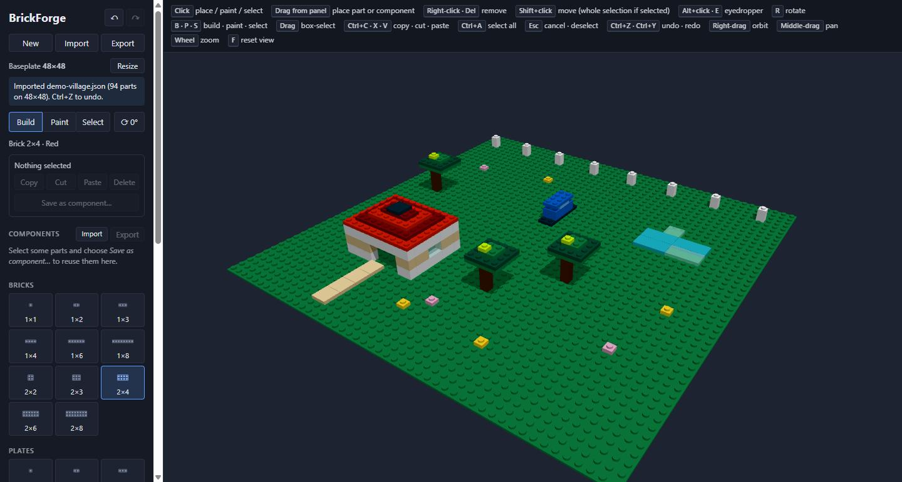
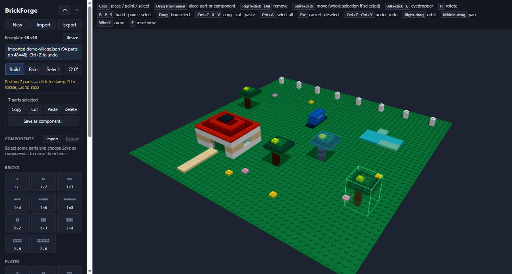
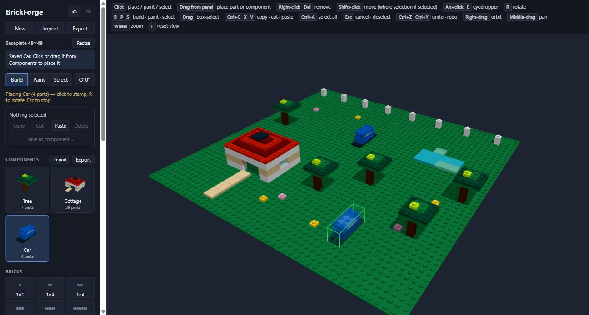
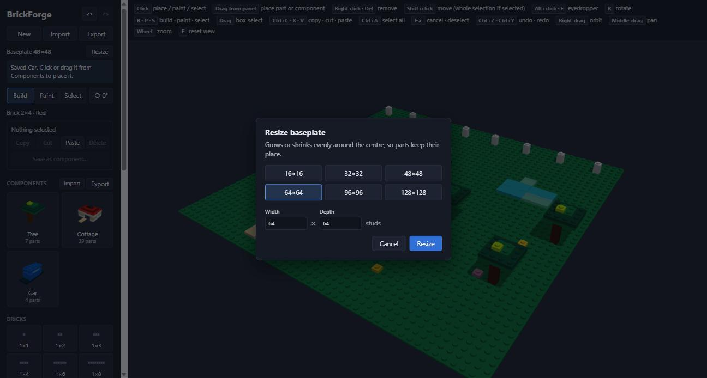

# BrickForge

A 3D brick-building sandbox that runs in the browser. Snap bricks, plates and tiles onto a
baseplate, copy and paste whole structures, and save your favourite builds as reusable components.

Built with **Blazor WebAssembly (.NET 10)** and **Three.js**.

**▶ Try it in your browser: https://legolife.github.io/BrickForge/** (no install needed; the first load
takes a few seconds while the .NET runtime downloads)



## Features

- **Real brick proportions**: bricks, plates and tiles from 1×1 up to 6×8, snapped to a stud grid
  (1 stud = 8 mm, 1 plate = 3.2 mm, 1 brick = 3 plates).
- **Free placement**: point at any face of a part and the new one sits flush against it, or on top, or
  hanging underneath. Parts can float, and [ and ] raise or lower the ghost to place one in open air.
  Parts can't overlap: the ghost preview turns green or red as you move it.
- **Alignment guides**: while the ghost is above the baseplate, lines drop from its corners and its
  footprint is outlined on the baseplate.
- **23 colours**, including transparent ones, plus an eyedropper and a paint mode.
- **Select, copy, cut and paste**: click, Ctrl+click or drag a box to select. Pasted groups
  follow the cursor, rotate with R, and stamp copies until you press Esc. Shift+click moves a whole selection.
- **Components**: save a selection as a named component with a rendered thumbnail, then click or drag it
  from the panel onto the baseplate. The library can be exported and imported on its own.
- **Drag and drop** single parts from the palette straight onto the baseplate.
- **Any baseplate size** from 8×8 to 128×128 studs, square or not. You can resize a build later and
  it stays centred.
- **Undo and redo** for everything, including imports, resizes and clearing the build.
- **Autosave** to browser storage, plus **import/export** of builds as compact JSON files.
- **Performance**: a 5,000-brick build renders in about 7 ms per frame. Studs that are covered by
  other parts aren't drawn at all.

| Select and paste | Components |
|---|---|
|  |  |



## Getting started

You need the [.NET 10 SDK](https://dotnet.microsoft.com/download).

```sh
git clone https://github.com/LegoLife/BrickForge.git
cd BrickForge
dotnet run --project src/BrickForge.Web
```

Then open http://localhost:5192. There's no build step for the JavaScript: Three.js is vendored under
`src/BrickForge.Web/wwwroot/lib/three`.

Every push to `master` runs the tests and redeploys the live site through
[`.github/workflows/pages.yml`](.github/workflows/pages.yml).

To try the demo scene from the screenshots, use **Import** in the panel and pick
[`samples/demo-village.json`](samples/demo-village.json). Import
[`samples/demo-components.json`](samples/demo-components.json) under **Components** to get the Tree,
Cottage and Car.

## Controls

| Input | Action |
|---|---|
| Click | Place (Build mode) · paint (Paint mode) · select (Select mode) |
| Drag from the panel | Place a part or component |
| Right-click · Del | Remove a part (Del removes the selection if there is one) |
| Shift+click | Pick up a part to move it, or the whole selection if the part is selected |
| Alt+click · E | Eyedropper |
| R · Shift+R | Rotate |
| ] · [ | Raise · lower the ghost one plate (Shift: one brick) |
| B · P · S | Build · Paint · Select mode |
| Drag (Select mode) | Box-select |
| Ctrl+C · Ctrl+X · Ctrl+V | Copy · cut · paste |
| Ctrl+A | Select all |
| Esc | Cancel a move or paste, or clear the selection |
| Ctrl+Z · Ctrl+Y | Undo · redo |
| Right-drag · Middle-drag · Wheel | Orbit · pan · zoom |
| F | Reset the camera |

## How it's built

```
src/BrickForge.Core        The model, with no UI dependencies: parts, placement rules, groups,
                           the editor (tools, selection, clipboard, undo/redo), file formats
src/BrickForge.Web         Blazor WebAssembly app: panel UI, storage, and the Three.js viewport
tests/BrickForge.Core.Tests xUnit tests for the Core rules
samples/                   Example build and component library
```

C# owns the model and every rule. The JavaScript viewport only draws what it's told and reports where
the pointer is, so all the rules can be unit-tested without a browser:

```sh
dotnet test
```

## Disclaimer

BrickForge is a hobby project. It is not affiliated with, endorsed by, or connected to the LEGO Group.
LEGO® is a trademark of the LEGO Group.
